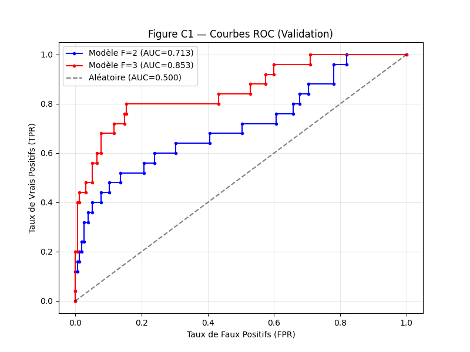
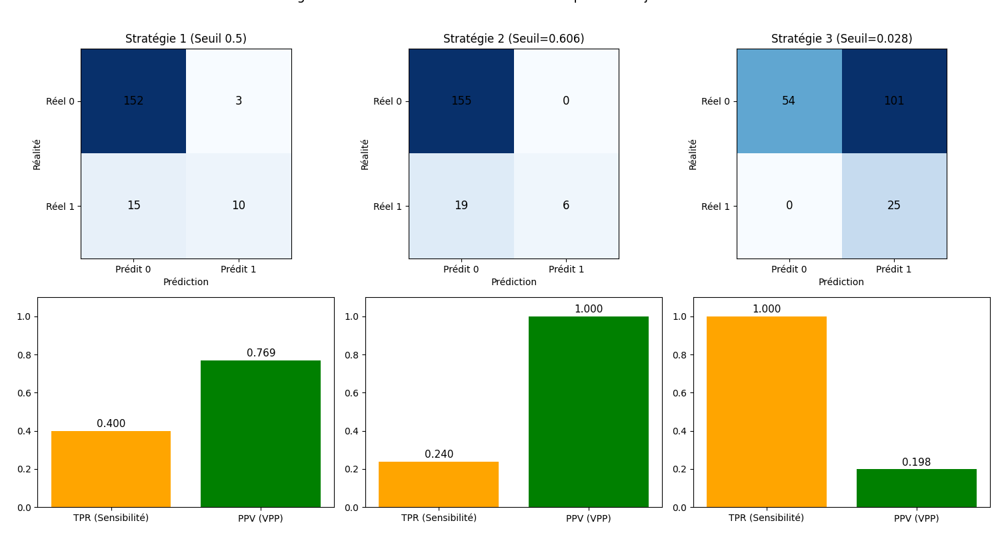

# Rapport de TP : Évaluation des classificateurs binaires et régression logistique

## 1. Introduction
Ce rapport présente l'analyse des performances de modèles de prédiction du risque de cancer basés sur des données médicales de 750 patients. L'objectif est de fournir une recommandation robuste pour le dépistage, en tenant compte des enjeux cliniques critiques.

## 2. Bloc A — Analyse descriptive des données

### Table A1 : Descriptif des ensembles de données
| Ensemble | Observations | Cas Positifs | Fraction de Positifs |
| :--- | :---: | :---: | :---: |
| Train | 390 | 55 | 14.1% |
| Validation | 180 | 25 | 13.9% |
| Test | 180 | 25 | 13.9% |

### Question A2 : Pourquoi l'accuracy seule est-elle trompeuse ?
L'accuracy (exactitude) mesure la proportion globale de prédictions correctes. Dans notre jeu de données, environ 86% des patients n'ont pas de cancer. Un modèle naïf qui prédirait "pas de cancer" pour tout le monde obtiendrait une accuracy de 86%, ce qui semble élevé. Cependant, un tel modèle ne détecterait aucun cas de cancer (TPR = 0), ce qui est inacceptable en médecine. L'accuracy ne distingue pas les types d'erreurs (Faux Positifs vs Faux Négatifs), or dans ce contexte, un Faux Négatif est bien plus grave qu'un Faux Positif.

## 3. Bloc B — Baseline et coûts des erreurs

### Question B1a : Résultats du classificateur naïf « predict-0-always »
Sur le jeu de test, ce classificateur obtient une **accuracy de 86.11%**.
En pratique, ce n'est **pas un bon classificateur**. Bien qu'il soit souvent "correct", il échoue systématiquement à remplir sa mission principale : identifier les malades. Son taux de vrais positifs (TPR) est de 0%.

### Question B1b : Analyse clinique des erreurs (FP vs FN)
- **Faux Négatif (FN)** : Le modèle prédit l'absence de cancer alors que le patient est atteint. Le patient ne subit pas de biopsie, ce qui entraîne un retard de diagnostic et met sa vie en danger immédiat (risque vital).
- **Faux Positif (FP)** : Le modèle prédit un cancer alors que le patient est sain. Le patient subit une biopsie inutile, entraînant un coût médical, du stress psychologique et des risques de complications liés à l'examen.

### Question B1c : Métriques prioritaires
Dans ce contexte, le **TPR (Sensibilité)** doit être la priorité absolue pour s'assurer qu'aucun patient atteint n'est ignoré. Dans un second temps, la **PPV (Valeur Prédictive Positive)** est importante pour limiter le nombre de biopsies inutiles, mais elle ne doit pas être maximisée au détriment du TPR.

## 4. Bloc C — Régression logistique et sélection de modèles

### C1. Rôle du paramètre C et régularisation
Le paramètre $C$ est l'inverse de la force de régularisation ($C = 1/\lambda$).
- Une valeur de **$C$ faible** impose une forte régularisation (pénalité L2), ce qui simplifie le modèle pour éviter le surapprentissage (overfitting).
- Une valeur de **$C$ élevée** réduit la régularisation, permettant au modèle de coller davantage aux données d'entraînement, au risque de perdre en généralisation.
Nous avons sélectionné $C$ en minimisant la log-loss sur le jeu de validation pour trouver le meilleur compromis biais-variance.

### Question C2 : Comparaison par courbes ROC (Figure C1)
La Figure C1 montre que le modèle **F=3 (marker, age, famhistory)** domine nettement le modèle **F=2 (age, famhistory)** sur toute la plage du graphique. L'AUC (Aire Sous la Courbe) passe de **0.713** pour F=2 à **0.853** pour F=3.

**Recommandation :** Le modèle F=3 est recommandé car il offre une bien meilleure capacité de séparation entre les classes, permettant d'atteindre un TPR élevé avec beaucoup moins de faux positifs que le modèle F=2.

## 5. Bloc D — Choix du seuil de décision (Modèle F=3)

### Question D2 : Stratégie recommandée pour éviter la mortalité
Nous avons comparé trois stratégies sur le jeu de test (voir Figure D1) :
1. **Seuil 0.5** : TPR = 0.400, PPV = 0.769. Trop de cancers manqués (15 sur 25).
2. **Stratégie 2 (PPV >= 0.98)** : TPR = 0.240. Très conservatrice, rate encore plus de cas.
3. **Stratégie 3 (TPR >= 0.98)** : Sur le test, nous obtenons un **TPR de 1.000** avec un seuil de **0.028**.

**Décision :** La **Stratégie 3** est la seule acceptable si la priorité est d'éviter toute erreur potentiellement mortelle. Elle garantit que tous les cas de cancer du jeu de test sont identifiés (FN = 0).

### Question D3 : Réduction des biopsies inutiles
Dans la pratique actuelle (biopsier tout le monde), on effectuerait 180 biopsies pour trouver 25 cancers, soit **155 biopsies inutiles**.
Avec la **Stratégie 3** :
- Nombre de biopsies recommandées : 126 (101 FP + 25 TP).
- Biopsies inutiles évitées : **54** (155 - 101).
- Cela représente une réduction de **34.8%** des biopsies inutiles par rapport à la pratique systématique, tout en conservant une sécurité totale pour les patients atteints.

## 6. Bloc E — Perte logistique et stabilité numérique

### Problématiques numériques et Logsumexp
Lors du calcul de la perte logistique ($BCE$), l'utilisation directe de la sigmoïde peut mener à des problèmes de précision :
1. **Saturation** : Pour des scores $s$ très grands ou très petits, $\sigma(s)$ tend vers 1 ou 0. Le calcul de $\log(1-p)$ peut alors entraîner un $-\infty$ ou une perte de précision.
2. **Logsumexp** : Cette fonction évite les dépassements de capacité (overflow) en factorisant le terme maximal : $\log(\sum e^{x_i}) = x_{max} + \log(\sum e^{x_i - x_{max}})$.
En exprimant la BCE directement en fonction des scores via `logsumexp`, on garantit un calcul stable même pour des valeurs extrêmes, évitant ainsi les erreurs numériques "NaN".
